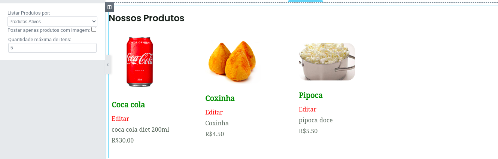
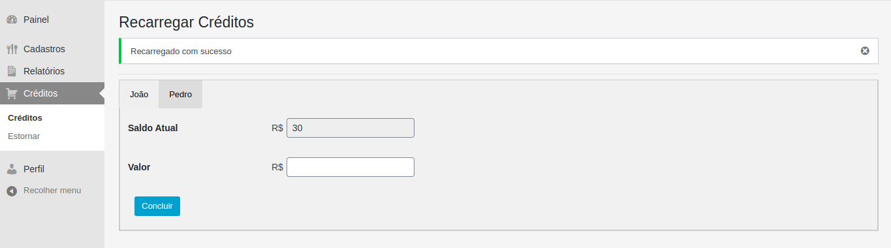
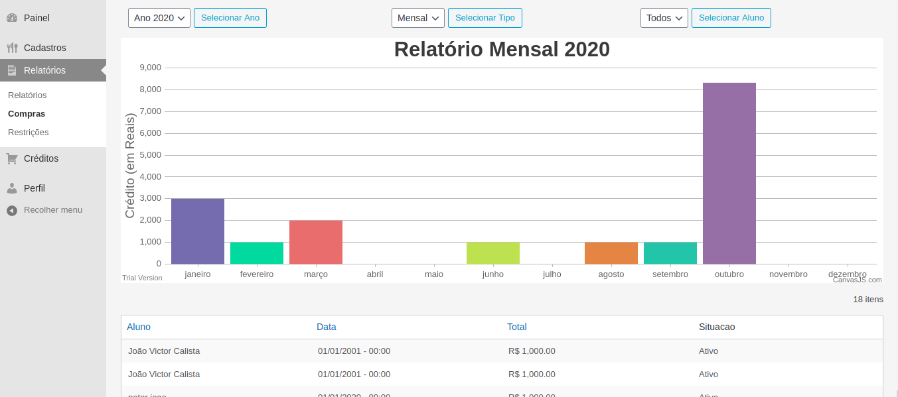

# KidsPay
Componente do Trabalho de conclusão de Curso na Fatec de Campinas.
Um pequeno sistema para gestão de créditos em cantinas de cantinas de escolas.

### Dependencias

  Ultimo Teste em: WordPress 5.5 25/10/2020
  
  WP-CanvasJS - Já incluso em vendor

## Contribuindo

1. Fork (<https://github.com/stdmedoth/KidsPay/fork>)
2. Crie seu branch (`git checkout -b feature/algo`)
3. Comite as alterações (`git commit -am 'Adicionando algo'`)
4. Suba como branch (`git push origin feature/algo`)
5. Crie um pull request

## Contato

jovictor210@gmail.com

# Widgets

Widgets com configuração personalida
Produtos por promoções semanais

# Créditos

Recarregamento de créditos pelo site

# Relatórios Compras e Vendas

Relatórios com possíbilidade de filtros por periodo e alunos

